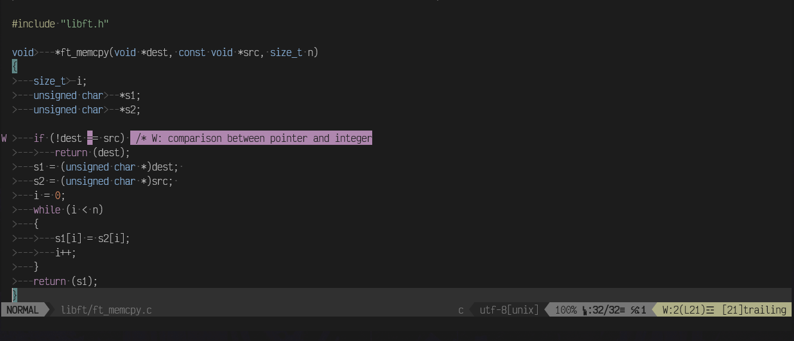

# Configuração do VIM *(.vimrc)*

Aqui uma configuração simples. 
Pensada principalmente para a *escola 42.*

 

**Foi incluído:**
- Plugins úteis (edição código, navegação e tema)
- Atalhos personalizados
- Configurações para as normas da 42
- Comentários explicativos em cada secção do .vimrc

*Caso não necesite de uma configuração ou Plugin basta comentar a linha.*

--- 

## Instalação 

Para utilizar esta configuração do Vim, basta instalar os seguintes plugs
rodando os seguintes comandos:

1. Instale o [vim-plug](https://github.com/junegunn/vim-plug) (gerenciador de plugins):
```bash 
curl -fLo ~/.vim/autoload/plug.vim --create-dirs https://raw.githubusercontent.com/junegunn/vim-plug/master/plug.vim
```

2. Baixe este .vimrc
```bash
curl -o ~/.vimrc https://raw.githubusercontent.com/p1nh4/vimrc/main/.vimrc
```

3. Abra o Vim e rode na barra de comandos
```bash
:PlugInstall
```
--- 

## Resumo Configurações


---

### Plugins 

| Categoria                 | Plugin                                                                                                   | Descrição                       |
| ------------------------- | -------------------------------------------------------------------------------------------------------- | ------------------------------- |
| **Tema**                  | [morhetz/gruvbox](https://github.com/morhetz/gruvbox)                                                    | Tema clássico escuro            |
| **Status bar**            | [vim-airline](https://github.com/vim-airline/vim-airline)                                                | Barra de status moderna         |
| **Árvore de arquivos**    | [NERDTree](https://github.com/preservim/nerdtree)                                                        | Navegação de diretórios         |
| **Comentário rápido**     | [vim-commentary](https://github.com/tpope/vim-commentary)                                                | Comentar/descomentar linhas     |
| **Manipulação de pares**  | [vim-surround](https://github.com/tpope/vim-surround)                                                    | Trabalhar com aspas e colchetes |
| **Fechamento automático** | [auto-pairs](https://github.com/jiangmiao/auto-pairs)                                                    | Fecha aspas e parênteses        |
| **Snippets**              | [UltiSnips](https://github.com/SirVer/ultisnips) + [vim-snippets](https://github.com/honza/vim-snippets) | Atalhos de código               |
| **Tela inicial**          | [vim-startify](https://github.com/mhinz/vim-startify)                                                    | Tela de boas-vindas             |
| **Header 42**             | [42header](https://github.com/42Paris/42header)                                                          | Cabeçalho automático da 42      |
| **Linting (C/C++)**       | [ALE](https://github.com/dense-analysis/ale)                                                             | Análise estática e formatação   |

---

### Atalhos

| Atalho     | Função                               |
| ---------- | ------------------------------------ |
| `<Space>w` | Salvar                               |
| `<Space>q` | Sair                                 |
| `<Space>x` | Salvar e sair                        |
| `<Space>c` | Fechar buffer                        |
| `jj`       | Sair do modo inserção                |
| `<F3>`     | Abrir/fechar NERDTree                |
| `<Space>n` | Mostrar/esconder números             |
| `<Space>l` | Mostrar/esconder espaços/tabs        |
| `<Space>z` | Alternar dobramento de código (fold) |

---

## Bom código!
```c
#include <unistd.h>

int main(void)
{
    char *autor = "@p1nh4";
    write(1, autor, 6);  
    return (0);
}
```
